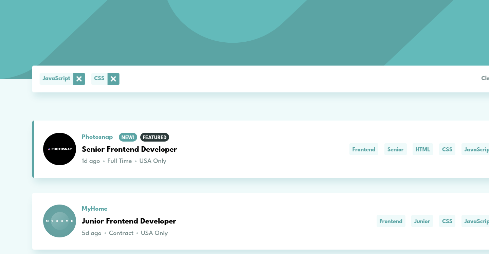
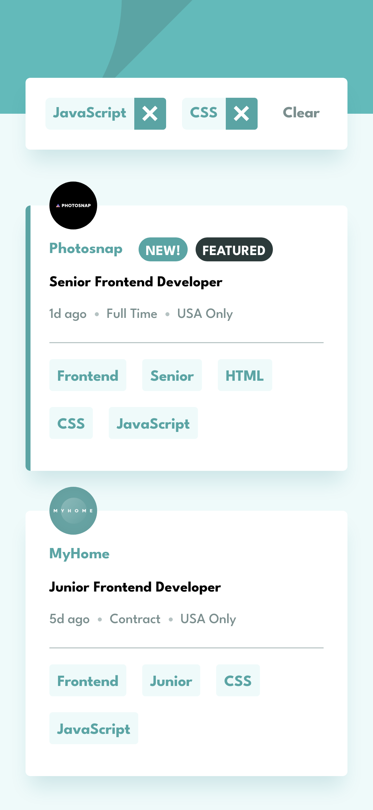

# Frontend Mentor - Loopstudios landing page solution

This is a solution to the [Loopstudios landing page challenge on Frontend Mentor](https://www.frontendmentor.io/challenges/loopstudios-landing-page-N88J5Onjw). Frontend Mentor challenges help you improve your coding skills by building realistic projects.

## Table of contents

- [Overview](#overview)
  - [The challenge](#the-challenge)
  - [Screenshot](#screenshot)
  - [Links](#links)
- [My process](#my-process)
  - [Built with](#built-with)
  - [Useful resources](#useful-resources)
- [Author](#author)

## Overview

### The challenge

Users should be able to:

- View the optimal layout for the site depending on their device's screen size
- See hover states for all interactive elements on the page

The designs were created to the following widths:

- Mobile: 375px
- Desktop: 1440px

### Screenshot

Solution screenshot for desktop (1440px screen width)

Solution screenshot for mobile (375px screen width)

### Links

- Live Site URL: [frontend-mentor-landing-page-nine.vercel.app](https://frontend-mentor-landing-page-nine.vercel.app/)

## My process

### Built with

- Semantic HTML5 markup
- CSS custom properties
- Flexbox
- CSS Grid
- Mobile-first workflow
- no JavaScript

### Useful resources

- [Create a responsive navigation nav with no JS](https://www.youtube.com/watch?v=8QKOaTYvYUA&t=729s) - This has a useful hack on how to do a hamburger without js. Although I think that it might be better to just use JS, this is because sooner or later there comes the time whe you need to handle some edge cases where JS would be required, like action tracking, or adding an alternative way of closing navigation. For this simple site pure CSS worked just fine.

## Author

- Website - [linkedin](https://www.linkedin.com/in/artur-jedrzejczak/)
- Frontend Mentor - [profile](https://www.frontendmentor.io/profile/aratur)
